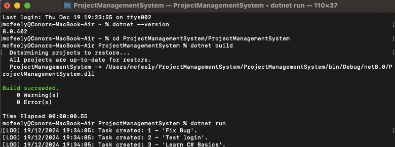

# ProjectManagementSystem :file_folder:

Team project by Team 7 for the module SWDE_IT803 - LY_ICSWD_B: Software Development

---

## Introduction

The **Project Management System** is a program done in C# using Visual Studio interface. Its primary features are organising tasks, managing teamwork and track the progress of projects. The main object-oriented programming (OOP) principles such as *Inheritance*, *Encapsulation*, *Abstraction* and *Polymorphism* are used throughout the program. This system supports various user roles such as Managers, Developers, QA Engineers, and Interns, and they all have their designated responsibilities.

This system is designed to be adaptable and simple to extend, making it well-suited for managing new requirements while maintaining good coding standards.

### Dependencies :gear:
- **Visual Studio Code**: Version 17.6 or later.
- *.NET desktop development* or *ASP.NET and web development* workload

---

---

*The UML class diagram* illustrates how the components of the system are linked. It explains how various user roles and tasks interact, applying principles such as inheritance, abstraction, and polymorphism.

---

## Getting Started

### Prerequisites 💻
To run this project, you'll need:
- .NET SDK (6.0 or later)
- Git

### Open Terminal 🖥️
**Windows**
- Press `Win + X` and select "Terminal" or
- Right-click and select "Open in Terminal"

**macOS**
- Press `Command + Space`, type "Terminal" and press Enter or
- Open Finder > Applications > Utilities > Terminal

### Installation and Setup ⬇️
1. Clone the repository:
git clone https://github.com/cwmcfeely/ProjectManagementSystem.git
cd ProjectManagementSystem

### Build and Run 🚀
- dotnet clean
- dotnet restore
- dotnet build
- dotnet run

### Build and Test 🛠️
- dotnet clean
- dotnet build
- dotnet test
